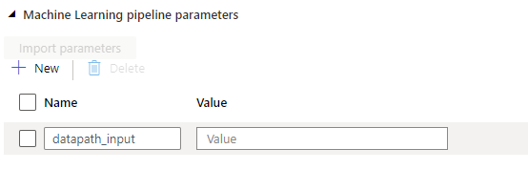

# datapath-parallelrunstep

---
DISCLAIMER

THE SOFTWARE IS PROVIDED "AS IS", WITHOUT WARRANTY OF ANY KIND, EXPRESS OR IMPLIED, INCLUDING BUT NOT LIMITED TO THE WARRANTIES OF MERCHANTABILITY, FITNESS FOR A PARTICULAR PURPOSE AND NONINFRINGEMENT. IN NO EVENT SHALL THE AUTHORS OR COPYRIGHT HOLDERS BE LIABLE FOR ANY CLAIM, DAMAGES OR OTHER LIABILITY, WHETHER IN AN ACTION OF CONTRACT, TORT OR OTHERWISE, ARISING FROM, OUT OF OR IN CONNECTION WITH THE SOFTWARE OR THE USE OR OTHER DEALINGS IN THE SOFTWARE

---


### Summary

This is a a code sample which enables passing a [Datapath](https://docs.microsoft.com/en-us/python/api/azureml-core/azureml.data.datapath.datapath?view=azure-ml-py) input as [PipelineParameters](https://docs.microsoft.com/en-us/python/api/azureml-pipeline-core/azureml.pipeline.core.pipelineparameter?view=azure-ml-py) to a 2-step AML pipeline.

As of now, datapath input parameter cannot be passed into ParallelRunStep as such. Therefore in this example, we create a PythonScriptStep in order to parametirise our pipeline via [PipelineParameters](https://docs.microsoft.com/en-us/python/api/azureml-pipeline-core/azureml.pipeline.core.pipelineparameter?view=azure-ml-py) for altering various DataPath inputs.

Once the pipeline is published, one can invoke it from ADF using the **machine learning data path assignments**. Enabling in that way a pipeline to be run with varying input data.

### Integration with Azure Data Factory

It is assumed that you have established a connection between AML and ADF and you have selected your pipeline ID/name. If you haven't done so, find instructions [here](https://docs.microsoft.com/en-us/azure/synapse-analytics/machine-learning/quickstart-integrate-azure-machine-learning).

By default, you will only see the parameters being imported at the “Machine Learning pipeline parameters” field. E.g.



This  is **NOT** where you need to change the input data path. This is only for string type parameters.

By default, the “Machine Learning data path assignments” is not populated. The correct way to populate at this point  is by “hacking” JSON code in order to include the below fields. 

```{python}
 "typeProperties": {
                    "experimentName": "parallelstepwork",
                    "mlPipelineParameters": {
                        "input_datapath": "workspaceblobstore/parquet/"
                    },
                    "mlPipelineEndpointId": "43009f00-e434-47ec-b6ac-063e64f03ab1",
                    "version": "0",
                    "dataPathAssignments": {
                        "input_datapath": {
                            "DataStoreName": "workspaceblobstore",
                            "RelativePath": "parquet/offerpath2" 
                        }
                    }
                }
```
Once you save the changes you made in the JSON, the data path assignments field will be populated and you will be able to make changes there. 


### Reference links

[Official sample notebook for Showcasing DataPath and PipelineParameter](https://github.com/Azure/MachineLearningNotebooks/blob/master/how-to-use-azureml/machine-learning-pipelines/intro-to-pipelines/aml-pipelines-showcasing-datapath-and-pipelineparameter.ipynb)

